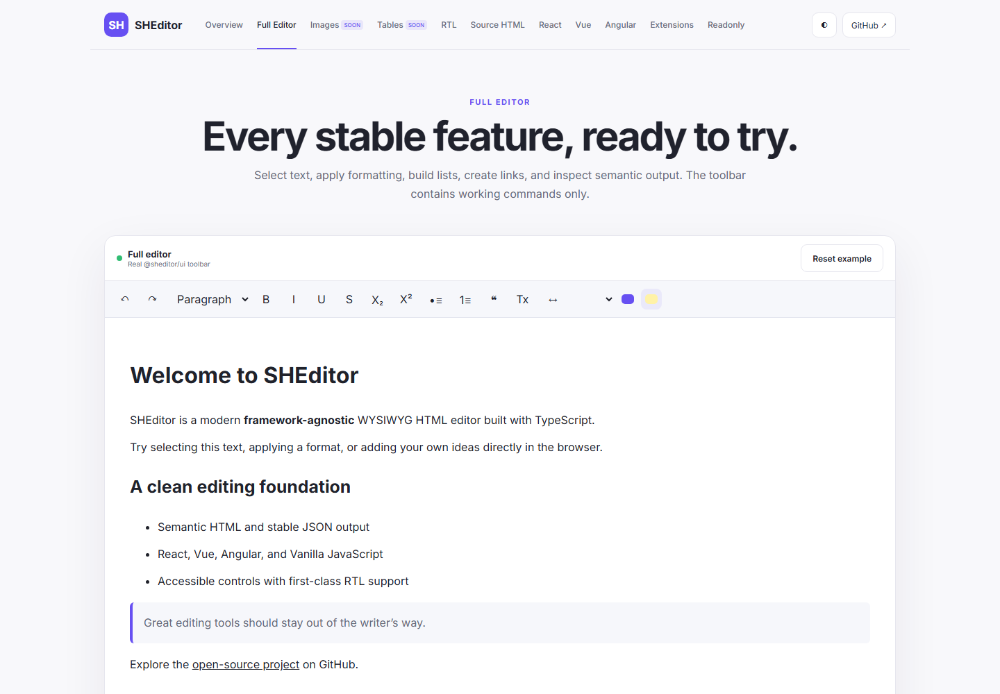

[English](README.md) | [فارسی](README.fa.md) | [العربية](README.ar.md)

<div dir="rtl">

# SHEditor

SHEditor منصة مجانية ومستقلة عن أطر العمل لتحرير HTML بأسلوب WYSIWYG، مبنية باستخدام TypeScript الصارم ومكونات ProseMirror الأساسية. يجري تطويرها نحو تغطية احترافية واسعة، ولا تدّعي حالياً التكافؤ الكامل مع CKEditor.

[التجربة الحية](https://mahdiporkar.github.io/SHEditor/) · [البنية](docs/ARCHITECTURE.md) · [مصفوفة الميزات المتحقق منها](docs/FEATURE_MATRIX.md) · [خارطة الطريق](docs/ROADMAP.md)



## الميزات الرئيسية

- الفقرات والعناوين H1–H6 والقوائم والاقتباس والشفرة والروابط والسجل
- العريض والمائل والتحته خط والمشطوب والمنخفض والمرتفع والألوان والتمييز والخط والحجم والمحاذاة
- Commands وEvents وChain API ونظام Extension مكتوب الأنواع
- تنقية Allowlist لـ HTML وURL والخصائص وCSS الخاص بالخطوط
- دعم أصلي للعربية والفارسية RTL والإنجليزية والسمات الفاتحة/الداكنة
- نواة واحدة مشتركة بين Vanilla TypeScript وReact وVue 3 وAngular

الصور والجداول وMarkdown وتحرير المصدر وميزات المستند والاستيراد/التصدير والتعليقات وتتبع التغييرات والمراجعات والتعاون ليست مكتملة. تعرض المصفوفة الحالة الدقيقة.

## التثبيت والبدء السريع

</div>

```bash
npm install @sheditor/core @sheditor/ui
```

```ts
const ui = createEditorUI(document.querySelector('#editor')!, {
  content: '<p>مرحباً SHEditor</p>',
  locale: 'ar', direction: 'rtl',
  onUpdate: ({ editor }) => console.log(editor.getHTML()),
});
```

<div dir="rtl">

لبناء واجهة مخصصة استخدم `createEditor()` من `@sheditor/core`. حزم الأطر هي `@sheditor/react` و`@sheditor/vue` و`@sheditor/angular`، ولا ندّعي نشرها على npm قبل إصدار رسمي.

## React

</div>

```tsx
const [value, setValue] = useState('<p>مرحباً</p>');
<SHEditor value={value} onChange={setValue} />
```

<div dir="rtl">

استخدم `defaultValue` للوضع غير المتحكم به. يوفّر `SHEditorRef` كلاً من `editor` و`focus()` و`getHTML()`، ويتجنب الغلاف إعادة ضبط التحديد عندما تكون قيمة React مطابقة للمحتوى.

## Vue 3

</div>

```vue
<script setup lang="ts">
const content = ref('<p>مرحباً</p>');
</script>
<template><SHEditor v-model="content" locale="ar" /></template>
```

<div dir="rtl">

يصدر المكون `update:modelValue` و`ready`، ويقبل `locale` و`editable` و`placeholder`، ويكشف `getEditor()` و`focus()`.

## Angular وForms

</div>

```ts
@Component({
  standalone: true,
  imports: [ReactiveFormsModule, SHEditorComponent],
  template: `<she-editor [formControl]="content" />`,
})
export class EditorPage {
  content = new FormControl('<p>مرحباً</p>');
}
```

<div dir="rtl">

ينفذ المكون المستقل `ControlValueAccessor` للقيمة الابتدائية والتغييرات وreset وحالة touched وdisabled. يعيد حدث `ready` نسخة المحرر. يعمل `[(ngModel)]` عند استيراد `FormsModule`.

## الإعدادات وشريط الأدوات والأوامر

يشمل `SHEditorOptions` المحتوى وحالة التحرير واللغة والاتجاه والنص البديل والإضافات والتنقية وإعدادات typography وأحداث update/focus/blur. تقيّد قوائم السماح الخطوط والأحجام والألوان. لا يعرض شريط الأدوات إلا أوامر حقيقية.

تتضمن `editor.commands` التنسيق والمنخفض/المرتفع والألوان والتمييز والخط والمحاذاة والفقرات والعناوين والقوائم والاقتباس والروابط والخط الأفقي ومسح التنسيق والتراجع/الإعادة. تتوفر `chain()` و`can()` و`isActive()` للواجهات المخصصة.

## الأحداث وواجهات المحتوى

استخدم `onUpdate` و`onFocus` و`onBlur` أو اشترك بواسطة `editor.on()`؛ تعيد الدالة وظيفة إلغاء الاشتراك. الواجهات المنفذة هي `getHTML()` و`getJSON()` و`getText()` و`setContent()` و`focus()` و`blur()` و`setEditable()` و`setLocale()` و`destroy()`. لا توجد واجهات Markdown بعد.

## RTL والتعريب

</div>

```ts
createEditor({ locale: 'ar', direction: 'rtl', content: '<p>إصدار SHEditor يدعم React وEnglish.</p>' });
createEditor({ locale: 'fa', direction: 'rtl', content: '<p>ویرایش فارسی</p>' });
```

<div dir="rtl">

تتوفر قواميس typed للغات `en` و`fa` و`ar`، ويضبط الاتجاه عبر API المحرر نفسه وليس CSS خارجي فقط.

## الروابط

يقبل `setLink(href, title?)` روابط HTTP(S) والبريد والهاتف والروابط النسبية والداخلية، ويرفض المخططات الخطرة. واجهة target/rel/bookmark والربط التلقائي ما زالت جزئية.

## الصور وUpload Adapter

يدعم نظام الصور URL وBase64 وupload adapter للخادم، إضافةً إلى السحب/الإفلات واللصق وتغيير الحجم وalt/title والمحاذاة. راجع [دليل الصور والجداول](docs/IMAGES_AND_TABLES.md). تبقى التعليقات والصور المتجاوبة وواجهة تقدم الرفع ضمن الخطة.

## الجداول

نموذج الجدول وتحديد الخلايا وعمليات الصفوف والأعمدة والدمج والتقسيم والرؤوس وتغيير حجم الأعمدة والتسلسل HTML/JSON منفذة ومتاحة في التجربة. راجع [دليل الصور والجداول](docs/IMAGES_AND_TABLES.md).

## Source وMarkdown والمستند والاستيراد/التصدير

تعرض التجربة HTML/JSON/Text مباشرة للقراءة فقط وليست Source Editor. Markdown والترقيم وTOC والمخطط والحواشي والقوالب وmerge fields ولصق Office وPDF/DOCX وتصدير البريد **غير موجودة** حالياً.

## التعليقات وتتبع التغييرات والمراجعات والتعاون

هذه الميزات **غير منفذة**. سيكون التعاون حزمة اختيارية تعتمد على provider، ولا تعرض التجربة سلوكاً متعدد المستخدمين مزيفاً.

## Extensions وCustom Widgets

</div>

```ts
export const telemetry = defineExtension({
  name: 'telemetry',
  plugins: () => [new Plugin({})],
});
```

<div dir="rtl">

تعمل الإضافات المسماة واكتشاف التكرار. مساهمات schema/command/node-view العامة ما زالت جزئية، لذلك لا ينبغي للعقد المخصصة الاعتماد على تفاصيل core الداخلية.

## السمات وContent CSS

كل selectors محصورة ببادئة `she-`. استخدم `style.css` للواجهة و`content.css` لعرض HTML المحفوظ. السمات الفاتحة والداكنة والمخصصة والتجاوب والطباعة مدعومة.

## الأمان وإمكانية الوصول وSSR

تُنقّى المدخلات قبل التحليل؛ تحظر scripts وiframes ومعالجات الأحداث والروابط وCSS الخطرة وتوجد اختبارات XSS. تملك الأدوات labels وحالات focus/pressed ودعم لوحة المفاتيح، لكن لا ندّعي شهادة WCAG كاملة قبل axe واختبارات المتصفحات. لا تصل الحزم إلى DOM في top-level، بينما تبقى اختبارات Next/Nuxt/Angular SSR وFirefox/WebKit مطلوبة.

## التجربة الحية

أصبحت التجربة ذات hash routes متاحة على [GitHub Pages](https://mahdiporkar.github.io/SHEditor/). يتحقق workflow باسم `Deploy SHEditor Demo` من المشروع وينشر الناتج إلى فرع `gh-pages`. [دليل النشر](docs/GITHUB_PAGES.md)

## التطوير والاختبار

</div>

```bash
npm ci
npm run lint
npm run typecheck
npm test
npm run build
```

<div dir="rtl">

يغطي Vitest النواة والتحليل والتسلسل والأوامر والسجل وRTL ودورة الحياة وXSS. تبقى اختبارات E2E للأطر والمتصفحات بوابة ضرورية للإصدار المستقر.

## الرخصة

[MIT](LICENSE) — يسمح بالاستخدام والتعديل والتوزيع.

</div>
