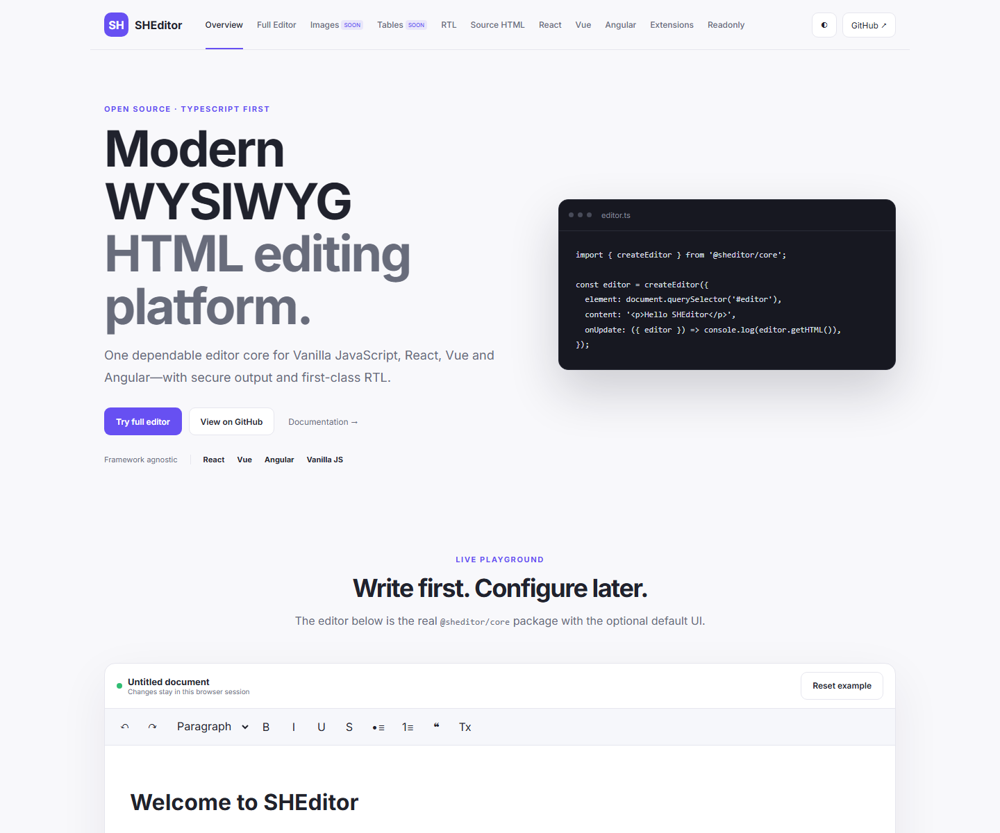

# SHEditor

> A free, MIT-licensed, TypeScript-first rich-text editor with Persian, English, and Arabic support.

[Live Demo](https://mahdiporkar.github.io/SHEditor/) · [Documentation](docs/ARCHITECTURE.md) · [Packages](packages/) · [GitHub](https://github.com/mahdiporkar/SHEditor)

The Live Demo URL becomes available after the first successful **Deploy SHEditor Demo** workflow. See [GitHub Pages setup](docs/GITHUB_PAGES.md).



[فارسی](#فارسی) · [English](#english) · [العربية](#العربية)

## Live Demo

Try the real workspace packages directly in your browser. The playground includes the full stable editor, Persian RTL editing, live HTML/JSON/text output, React/Vue/Angular examples, a real custom extension, readonly mode, responsive navigation, and persistent light/dark themes. Images and tables are clearly marked as upcoming milestones until their complete production features ship.

## فارسی

SHEditor یک ویرایشگر WYSIWYG رایگان و متن‌باز است که با TypeScript strict و هستهٔ ProseMirror ساخته شده است. هسته به هیچ فریم‌ورکی وابسته نیست و رابط آماده، پوسته‌ها و آداپترهای React، Vue 3 و Angular به‌صورت بسته‌های جدا ارائه می‌شوند.

### امکانات نسخهٔ 0.1

- پاراگراف، عنوان‌های H1 تا H6، نقل‌قول، کد، خط افقی و شکست خط
- پررنگ، کج، زیرخط، خط‌خورده، کد درون‌خطی و پیوند امن
- فهرست نشانه‌دار، شماره‌دار و تودرتو؛ تاریخچهٔ undo/redo و میانبرهای صفحه‌کلید
- دریافت و خروجی HTML معنایی، JSON پایدار و متن ساده
- پاک‌سازی HTML با allowlist و جلوگیری از script، iframe، رویدادهای مخرب و `javascript:` URL
- حالت ویرایش‌ناپذیر، پوسته روشن/تیره/سفارشی، CSS قابل‌استفاده برای محتوای خروجی و استایل چاپ
- رابط دسترس‌پذیر با ARIA، فوکوس واضح، صفحه‌کلید و پشتیبانی بومی RTL
- فرهنگ‌های `fa`، `en` و `ar` با امکان تغییر زبان در زمان اجرا
- API افزونهٔ typed، رویدادها، chain commands و پاک‌سازی کامل منابع در `destroy()`
- آداپتر React کنترل‌شده/کنترل‌نشده، `v-model` در Vue و `ControlValueAccessor` در Angular

### نصب و شروع سریع

```bash
npm install @sheditor/core @sheditor/ui
```

```ts
import { createEditorUI } from '@sheditor/ui';
import '@sheditor/ui/style.css';
import '@sheditor/ui/content.css';

const ui = createEditorUI(document.querySelector('#editor')!, {
  content: '<p>سلام دنیا</p>', locale: 'fa', direction: 'rtl',
  placeholder: 'اینجا بنویسید…',
  onUpdate: ({ editor }) => console.log(editor.getHTML()),
});
```

API اصلی: `commands`، `chain()`، `can()`، `isActive()`، `getHTML()`، `getJSON()`، `getText()`، `setContent()`، `setEditable()`، `setLocale()`، `focus()`، `blur()`، `on()` و `destroy()`. فرمان‌ها شامل قالب‌بندی‌ها، عنوان/پاراگراف، فهرست‌ها، نقل‌قول، پیوند، خط افقی، پاک‌کردن قالب و undo/redo هستند. گزینه‌های کامل در IntelliSense از نوع `SHEditorOptions` در دسترس‌اند.

React از `<SHEditor value={html} onChange={setHtml} />`، Vue از `<SHEditor v-model="html" />` و Angular از `<she-editor formControlName="content" />` پشتیبانی می‌کند. امکانات تصویر، جدول، همکاری و AI هنوز پیاده نشده‌اند؛ وضعیت دقیق در [ماتریس امکانات](docs/FEATURE_MATRIX.md) و برنامه در [نقشه راه](docs/ROADMAP.md) آمده است.

## English

SHEditor is a free and open-source WYSIWYG editor built with strict TypeScript and ProseMirror primitives. Its core is framework-independent; the default UI, themes, and React, Vue 3, and Angular adapters are separate packages.

### Version 0.1 features

- Paragraphs, H1–H6, blockquotes, code blocks, horizontal rules, and hard breaks
- Bold, italic, underline, strike, inline code, and safe links
- Bullet, ordered, and nested lists; transactional undo/redo and keyboard shortcuts
- Semantic HTML, stable JSON, and plain-text output
- Allowlist HTML sanitization blocking scripts, iframes, event handlers, and `javascript:` URLs
- Readonly mode, light/dark/custom themes, portable content CSS, and print styles
- Accessible ARIA toolbar, visible focus, keyboard operation, and first-class RTL
- `fa`, `en`, and `ar` dictionaries with runtime locale switching
- Typed extensions, events, chain commands, and deterministic cleanup through `destroy()`
- Controlled/uncontrolled React, Vue `v-model`, and Angular `ControlValueAccessor`

### Install and quick start

```bash
npm install @sheditor/core @sheditor/ui
```

```ts
import { createEditor } from '@sheditor/core';
const editor = createEditor({ element: document.querySelector('#editor')!, content: '<p>Hello</p>', onUpdate: ({ editor }) => console.log(editor.getJSON()) });
```

The public API includes `commands`, `chain()`, `can()`, `isActive()`, `getHTML()`, `getJSON()`, `getText()`, `setContent()`, `setEditable()`, `setLocale()`, `focus()`, `blur()`, `on()`, and `destroy()`. Typed commands cover marks, headings/paragraphs, lists, blockquotes, links, horizontal rules, clear formatting, and undo/redo. `SHEditorOptions` provides full IntelliSense.

Use `<SHEditor value={html} onChange={setHtml} />` in React, `<SHEditor v-model="html" />` in Vue, and `<she-editor formControlName="content" />` in Angular. Images, tables, collaboration, and AI are not implemented yet; see the honest [feature matrix](docs/FEATURE_MATRIX.md) and [roadmap](docs/ROADMAP.md).

## العربية

SHEditor محرر WYSIWYG مجاني ومفتوح المصدر، مبني بـ TypeScript الصارم ومكونات ProseMirror الأساسية. النواة مستقلة عن أطر العمل، بينما تتوفر الواجهة الافتراضية والسمات ومحولات React وVue 3 وAngular كحزم منفصلة.

### ميزات الإصدار 0.1

- الفقرات والعناوين H1–H6 والاقتباس وكتل الشفرة والخط الأفقي وفاصل السطر
- العريض والمائل وتحته خط ويتوسطه خط والشفرة المضمنة والروابط الآمنة
- قوائم نقطية ومرقمة ومتداخلة، وتراجع/إعادة بمعاملات واختصارات لوحة المفاتيح
- إخراج HTML دلالي وJSON مستقر ونص عادي
- تنقية HTML بقائمة سماح وحظر scripts وiframes ومعالجات الأحداث وروابط `javascript:`
- وضع القراءة فقط، وسمات فاتحة/داكنة/مخصصة، وCSS مستقل للمحتوى والطباعة
- شريط أدوات متاح مع ARIA وتركيز واضح ودعم لوحة المفاتيح وRTL أصلي
- قواميس `ar` و`fa` و`en` وتغيير اللغة أثناء التشغيل
- إضافات وأحداث وأوامر متسلسلة مكتوبة الأنواع وتنظيف كامل عبر `destroy()`
- React متحكم/غير متحكم، و`v-model` في Vue، و`ControlValueAccessor` في Angular

### التثبيت والبدء

```bash
npm install @sheditor/core @sheditor/ui
```

```ts
import { createEditorUI } from '@sheditor/ui';
const ui = createEditorUI(document.querySelector('#editor')!, { content: '<p>مرحباً</p>', locale: 'ar', direction: 'rtl' });
```

تشمل API العامة `commands` و`chain()` و`can()` و`isActive()` و`getHTML()` و`getJSON()` و`getText()` و`setContent()` و`setEditable()` و`setLocale()` و`focus()` و`blur()` و`on()` و`destroy()`. تدعم الأوامر التنسيق والعناوين والفقرات والقوائم والاقتباسات والروابط والخط الأفقي ومسح التنسيق والتراجع/الإعادة، وتوفر `SHEditorOptions` إكمال IntelliSense كاملاً.

استخدم `<SHEditor value={html} onChange={setHtml} />` مع React، و`<SHEditor v-model="html" />` مع Vue، و`<she-editor formControlName="content" />` مع Angular. الصور والجداول والتعاون وAI غير منفذة بعد؛ راجع [مصفوفة الميزات](docs/FEATURE_MATRIX.md) و[خارطة الطريق](docs/ROADMAP.md).

## Development / توسعه / التطوير

```bash
npm install
npm run lint
npm run typecheck
npm test
npm run build
npm run dev
```

Licensed under [MIT](LICENSE). Architecture details are in [docs/ARCHITECTURE.md](docs/ARCHITECTURE.md).
